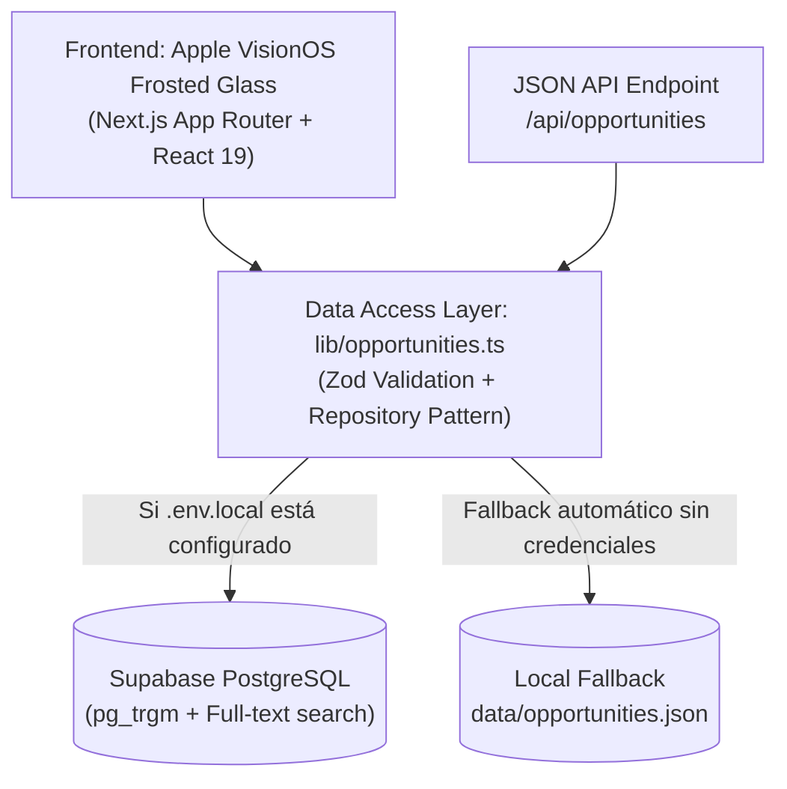

# Opportunities Hub — Breakout

> **Líder del proyecto:** Freddy Ñañez (Tech)  
> **Propósito:** Centralizar, validar y distribuir oportunidades de alto impacto en tecnología, innovación y emprendimiento (hackathons, becas, subsidios/grants, aceleradoras e incubadoras) para builders y founders de América Latina.

---

## 1. Arquitectura del Producto

El producto está diseñado como una aplicación web full-stack de alto rendimiento construida con **Next.js 16 (App Router)**, **React 19**, **TypeScript**, **Tailwind CSS v4** y **Bun**.



### Características Principales:
1. **Diseño Apple Frosted Glass / VisionOS:**
   - Superficies con desenfoque óptico (`backdrop-filter: blur(36px) saturate(180%)`).
   - Iluminación ambiental y malla reactiva en Azul Cobalto Breakout (`#214FDD`) y Cyan (`#6CE5E8`).
   - Islas de navegación y pie de página flotantes en píldora (`rounded-full`).
   - Bordes especulares de 1px con degradados de luz ambiental.
2. **Filtrado y Búsqueda en Tiempo Real:**
   - Búsqueda en texto completo por título, organización, tecnología o país.
   - Píldoras de filtro por categoría (Aceleradoras, Grants, Hackathons, Becas, etc.).
   - Selector de modalidad (100% Remoto, Presencial, Híbrido).
   - Ordenamiento por urgencia de cierre de convocatoria o fecha de publicación.
3. **Modal de Detalle Inmersivo:**
   - Hoja de detalle estilo VisionOS con especificaciones completas, criterios de elegibilidad, financiamiento/premios y botón de postulación oficial.
4. **Capa de Datos Híbrida & Resiliente:**
   - Conexión nativa a **Supabase PostgreSQL** con RLS y FTS en español.
   - Fallback automático e instantáneo a `data/opportunities.json` si no hay credenciales en `.env.local`.

---

## 2. Estructura del Proyecto

```
opportunities/
├── app/
│   ├── api/opportunities/route.ts  # Endpoint JSON REST
│   ├── globals.css                 # Tokens Apple Glass & Tailwind v4
│   ├── layout.tsx                  # Layout con iluminación ambiental y metadatos
│   └── page.tsx                    # Server Component inicial
├── src/
│   ├── components/                 # Componentes de UI modulares
│   │   ├── AmbientBackground.tsx   # Luces ambientales y grid
│   │   ├── CategoryFilterRow.tsx   # Filtros en píldoras
│   │   ├── FooterIsland.tsx        # Footer flotante
│   │   ├── HeroSection.tsx         # Portada editorial y métricas
│   │   ├── NavigationIsland.tsx    # Navbar flotante con marca
│   │   ├── OpportunitiesClient.tsx # Coordinador interactivo de estado
│   │   ├── OpportunityCard.tsx     # Tarjeta con borde especular
│   │   ├── OpportunityModal.tsx    # Modal de detalle VisionOS
│   │   └── SearchDock.tsx          # Dock flotante de búsqueda
│   └── lib/
│       ├── opportunities.ts        # Repositorio de datos y búsquedas
│       └── supabase.ts             # Cliente y detector de Supabase
├── __tests__/
│   └── acceptance.test.ts          # Suite de aceptación (R-1 a R-6)
├── data/
│   └── opportunities.json          # Catálogo validado con Zod
├── supabase/
│   └── schema.sql                  # Schema SQL, enums, FTS, RLS y seed
├── types.ts                        # Schemas Zod y tipos TypeScript
└── package.json
```

---

## 3. Comandos de Desarrollo

Entrar a la carpeta `opportunities/`:

```bash
cd opportunities
```

### Ejecutar los tests de aceptación:
```bash
bun test
```

### Comprobación de tipos TypeScript:
```bash
bun run typecheck
```

### Compilar para producción:
```bash
bun run build
```

### Iniciar servidor de desarrollo local:
```bash
bun run dev -- -p 3001
```

---

## 4. Conectar con Supabase

Para conectar tu base de datos de Supabase en producción:
1. Ejecuta el script SQL [`supabase/schema.sql`](file:///Users/freddy/projects/2-projects-stand-by/breakout/opportunities/supabase/schema.sql) en el SQL Editor de tu proyecto en Supabase.
2. Copia `.env.example` a `.env.local`:
   ```bash
   cp .env.example .env.local
   ```
3. Llena `NEXT_PUBLIC_SUPABASE_URL` y `NEXT_PUBLIC_SUPABASE_ANON_KEY`.
4. La app detectará automáticamente las credenciales y comenzará a consultar Supabase directamente con fallback automático ante cualquier falla de red.
